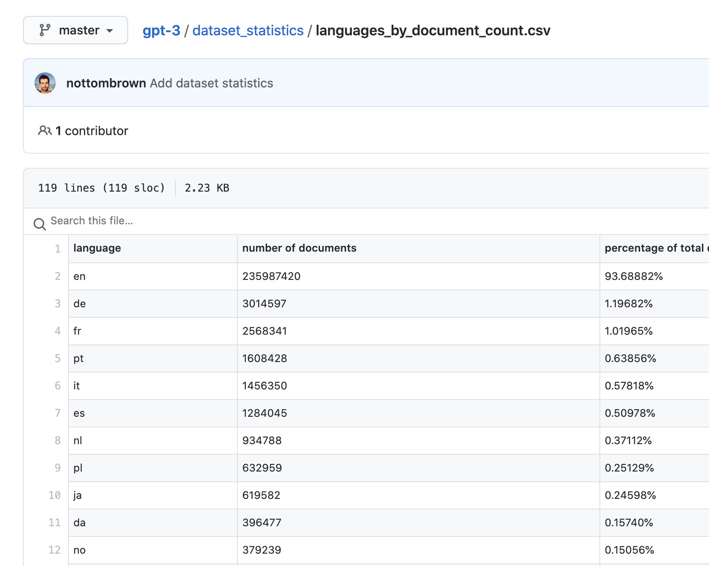

## 非常に興奮している

今週起こった出来事に驚きを隠せない。アメリカ発のAIがとんでもなくすごいのだ。

**たとえば...**

いくつかの文章を与える。するとそのあとのパラグラフを想定して文章をAIがしたためる。その完成度は与えた文章を書いた人が書いたかのような文章であった。

https://maraoz.com/2020/07/18/openai-gpt3/

たとえば...

各州の人口は?とたずねたらエクセルで表をまとめ始めてくれます。

https://twitter.com/pavtalk/status/1285410751092416513?s=20

**たとえば...**

TODOアプリの作成を依頼する... 3秒でREACT製のアプリを作成しました...

https://twitter.com/sharifshameem/status/1284421499915403264?s=20

はあ？何をいっているんだ？

www

**プログラマーいらんやんｗ**

事務職もいらんやんｗ

これらの結果を出すのに長大なトレーニングデータはいりません。すでにマイクロソフトのスーパーコンピュータで学習した状態のAIなのです。

## GTP-3とは

GTPシリーズは2015年にサンフランシスコに設立されたAI系の会社であるopenAIが開発した自然言語系のAIシステムである。openAIはイーロン・マスクも創業者として名を連ねておりそのポテンシャルが感じられるであろう。

Generative Pretrained Transformer 3の略で、事前にインターネットにある文章などでしっかりトレーニング済みの教師なしの言語が得意なAIです。３は３個めの作品ということです。

GPT-2の時点で完成度が高すぎて危険ではないかと言われており技術的な詳細はふせられていました。今回はGPT-2の１００倍以上ものパラメータをインプットし鍛えられた状態のものが公開されたわけです。

GPT-3に多少の言語を与えるとその次のパラグラフを予見して作成をします。すでに述べたように世界にある膨大な文章でプログラムコードも含んで学習ずみなので、使用者はちょっと情報を入れてあげるだけで、かれは我々を超えた回答をもたらします。

## 英語だけなのか？

かれはあらゆる言語をまなんでいるようです。下記はGithubの学習に使われたドキュメントの割合を示すデータです。10位にjaとあります。日本語もわずかながら学んだようです。英語のデータが93％なので英語が一番得意でしょうね。

## 人類はやばいのか？

少し安心したのですが、いろいろな解説を読む限り彼は彼自身のやっている事自体の理解が無いようです。抽象化という概念を身に着けていないため、膨大な学習からのアウトプットをしているだけのようです。

まあ抽象概念を身に着けて創造をされてしまっては、それ自体がシンギュラリティですからね。多少安心しています。

##　参考資料

https://en.wikipedia.org/wiki/OpenAI

https://webbigdata.jp/ai/post-6070

https://github.com/openai/gpt-3

https://openai.com/

https://www.axion.zone/openai-releases-gpt3/

http://deeplearning.hatenablog.com/entry/gpt3

https://arxiv.org/abs/2005.14165

