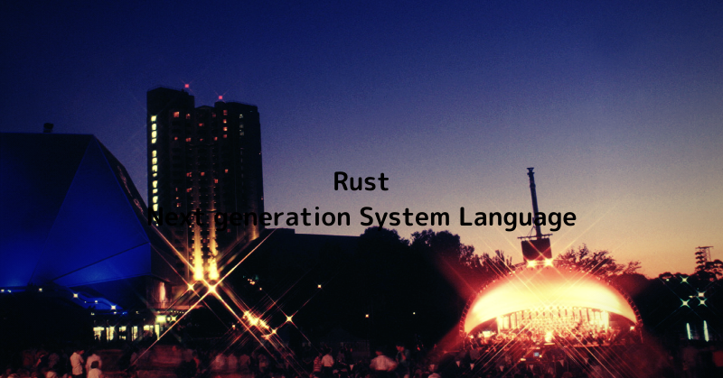
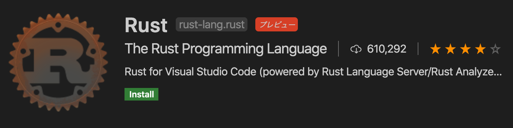
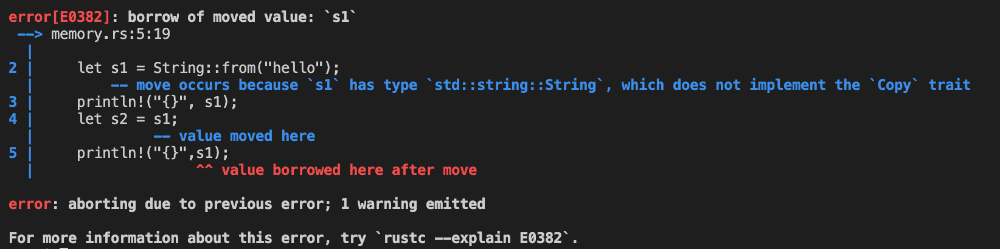

## Rust とは

Rustはメモリーの扱いがユニークな主にバックエンドとしてサーバーで活躍する言語として生まれた。狙う椅子はC++の占めている根幹をなすシステムプログラミング領域である。

ということで実行速度がC言語とほぼ同等といわれ最高位のスピードを誇る言語となる。

Rustは2006年に一人の男が個人プロジェクトとしてスタートし、その後Mozillaのプロジェクトとなり、現在はオープンソースプロジェクトとしてコミュニティの手によって開発が進められている。

とても若い言語である。

ここ最近、ギークな人たちの間で超人気である。


C言語で育った僕としてはC言語を勉強してほしいが、もしかしたらいま若い方はシステム言語としてRustを最初に学ばれるのも面白いキャリアパスかもしれない。いまの勢いだと、きっと将来いい武器になるだろう。


## メモリーの戦いの歴史

プログラムの泣き所は長年メモリーの扱いにある。20世紀のプログラミングではメモリーの漏れによるバグが頻発していた。開発環境などの改善でとてもバグは少なくなったが、c++のようなコアなところを扱えるプログラムはメモリーも自分自身ですべて管理する前提のため地雷が怖いものである。ちゃんとメモリー開放したのか？僕は大丈夫？

メモリーの扱いのトレンドはガベージコレクションとなった。これは実行時に必要がなくなったと判断されたメモリーは仕組みとして開放する。プログラマーはあまり意識しなくても良くなったのだ。

しばらくそれで時代は進んできたが、ガベージコレクションはその性質ゆえに、メモリーの整理のために定期的にCPUパワーを専有し掃除を行う。

僕らがPCで使うプログラムではあまり問題にならないが、サーバーでミリ秒マイクロ秒単位で活躍するプログラムには、プログラマーの手をはなれたガベージコレクションコレクションがパフォーマンスを阻害する要因となってしまった。


さてRustである。Rustはガベージコレクションを捨て、メモリーの厳密管理をプログラム時に行うことでメモリーリークがない世界をつくった！


**Rustのユニークな点**
**値は一人しか所有できない**


は？？？

何を行っているんですか？御子柴ぁーー


と聞こえてきそうです。


## インストール方法

[こちら](https://www.rust-lang.org/ja/tools/install)を参考にしましょう。

Mac/Linux勢は下記のコマンドをうちましょう

```bash
$ curl --proto '=https' --tlsv1.2 -sSf https://sh.rustup.rs | sh
```

windows勢の方は[こちら](https://www.rust-lang.org/ja/tools/install)からインストーラをダウンロードしてください


上記のコマンドをうつと下記の選択肢がでますのでおとなしく１をえらびましょう

```Badh
1) Proceed with installation (default)
2) Customize installation
3) Cancel installation
```


これで下記のコマンドを打って結果がでればインストールは成功です。

```
rustc --version
```


でも、パスの問題が出ることも。そのときはおとなしくパスを追加しましょう。

ツールは`~/.cargo/bin` に格納されますので `~/.zshrc`や`~/.bashrc`　のパスを編集しましょう。

例えば僕の場合はPATHの記載エリアに下記の行を追加しました

```
export PATH=$PATH:/Users/Mikoshiba/.cargo/bin
```

できたら

```bash
$ source ~/.zshrc
```

で反映させます。

これでもう一度

```bash
~$ rustc --version
rustc 1.45.2 (d3fb005a3 2020-07-31)
```


バッチリですね。これでつかえるようになりました


Visual Studio Code勢は　Rustのプラグインもいれておきましょう。名前は Rustなのですぐにみつかります。下記をクリックしてもらってもOkです

https://marketplace.visualstudio.com/items?itemName=rust-lang.rust



## 動作確認

では下記のコードを `mikoshiba.rs`の名前で作成します

```rust
fn main() {
    println!("Hello Mikoshiba");
}
```

でコマンドプロンプトで

```bash
$ rustc mikoshiba.rs 
$ ./mikoshiba 
```

これで Hello Mikoshibaと表示されれば大成功です！


## メモリー遊び

まずはこのコードをmemory.rsとしましょう

```rust
fn main() {
    let s1 = String::from("hello");
    println!("{}", s1);
}
```


でこれをこうします

```bash
$ rustc memory.rc
$ ./memory
```


すると普通に

```my word```

とでてきますね。


では下記はどうでしょう？よくあるコードですよね？データを渡して２つとも同じ値がはいっているはずです

```rust
fn main() {
    let s1 = String::from("hello");
    println!("{}", s1);
    let s2 = s1;
    println!("{}",s1);
    println!("{}",s2);
}
```

コンパイルすると...



怒っています。もうS1は値をもっていない let s2 = s1で　value moved hereと教えてくれています。これが値の所有権というものでした。


ちなみにですね...

```rust
fn main() {
    let s1 = "hello";
    println!("{}", s1);
    let s2 = s1;
    println!("{}",s1);
    println!("{}",s2);
}
```

これは怒られませんw。

この場合はコピーをしているようですね。コンパイル時に既知のサイズを持つものに関しては寛容にコピーをしてくれるようです。

つまり柔軟さも持ち合わせているようですね。このRustの公式ブログにこのあたりは記載があります。よかったら読んでみてください

https://doc.rust-jp.rs/book/second-edition/ch04-01-what-is-ownership.html


ではまた会いましょう


## 参考ページ

https://www.rust-lang.org/ja

https://www.rust-lang.org/ja/tools/install

https://doc.rust-jp.rs/


